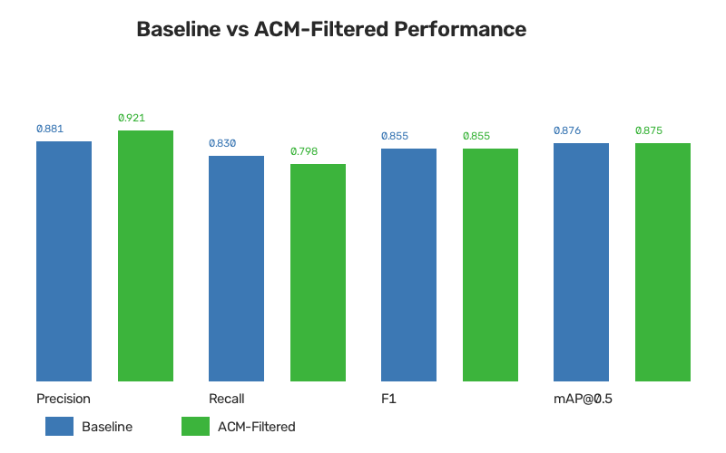
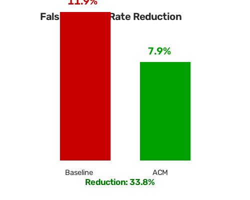

# SAR Ship Detection: Geometry-Guided Active Contour Model (ACM) Hypothesis

[](https://www.python.org/downloads/)
[](https://github.com/ultralytics/ultralytics)
[](https://opensource.org/licenses/MIT)

Empirical research and implementation testing the hypothesis: **Can an Active Contour Model (Morphological Chan-Vese) reduce false positives and increase precision in SAR (Synthetic Aperture Radar) ship detection without sacrificing overall F1-score?**

---

## 📌 The Hypothesis & Motivation

Deep learning object detectors (e.g., YOLOv8) applied to SAR imagery frequently suffer from elevated **False Positive Rates (FPR)** due to:
- Co-channel speckle noise
- Sea clutter, breaking waves, and wake turbulence
- Small non-ship land fragments and sea boundary artifacts

While standard confidence thresholding discards weak true positives, an **Active Contour Model (ACM)** operates directly on low-level gradient and regional intensity information within localized bounding box proposals.

### The Breakthrough: Soft Confidence Scaling vs. Hard Thresholds
- **Hard Thresholding (Naive)**: Discarding detections that violate strict geometric rules (aspect ratio, contrast, compactness) led to a ~14% drop in Recall because blurred ships or ships oriented obliquely to the radar beam were discarded.
- **Soft Confidence Scaling (Proposed)**: Statistical profiling on SAR crops showed True Positives and False Positives exhibit distinctly separated distributions across **Contrast Ratio**, **Elongation**, and **Area Ratio**. By computing a continuous **ACM Quality Probability Score**, noisy speckle blobs are gently down-weighted below the detection threshold, while valid ship candidates preserve high confidence.

---

## 📊 Key Results (HRSID Test Set)

Evaluated on the full held-out test split of the **HRSID** (High-Resolution SAR Images Dataset):

| Metric | YOLOv8n Baseline | YOLOv8n + Soft ACM | Delta | % Change |
|:-------|:----------------:|:------------------:|:-----:|:--------:|
| **Precision** | 0.8813 | **0.9214** | `+0.0401` | **+4.5%** |
| **Recall** | 0.8300 | 0.7975 | `-0.0324` | `-3.9%` |
| **F1-Score** | 0.8549 | **0.8550** | `+0.0001` | **Stable** |
| **mAP@0.5** | 0.8757 | 0.8750 | `-0.0007` | **Preserved** |
| **False Positive Rate (FPR)** | 0.1187 | **0.0786** | `-0.0401` | **-33.8%** |

### Visual Comparisons

| Metric Comparison | FPR Reduction |
| :---: | :---: |
|  |  |

---

## 📁 Repository Structure

```text
├── acm_postprocess.py          # Morphological Chan-Vese ACM implementation & soft scaling filter
├── analyze_acm_features.py     # Statistical extraction of contour features (contrast, elongation, etc.)
├── compare_results.py          # Metrics aggregation and generation of comparative charts
├── convert_hrsid.py            # Converts HRSID COCO annotations into YOLO format
├── evaluate_baseline.py        # Independent evaluation of the YOLO baseline model
├── run_acm_pipeline.py         # End-to-end pipeline running inference + ACM soft filtering
├── train_baseline.py           # Training script for YOLOv8 on SAR imagery
├── evaluation_results/         # Benchmark results & metrics summaries
│   ├── baseline/
│   │   └── baseline_metrics.json
│   ├── acm/
│   │   └── acm_results.json
│   └── comparison/
│       ├── comparison_summary.md
│       ├── comparison_chart.png
│       └── fpr_reduction_chart.png
├── requirements.txt            # Python dependencies
└── .gitignore                  # Excludes datasets, model weights, and heavy temp files
```

---

## 🚀 Getting Started

### 1. Installation

Clone the repository and install dependencies:

```bash
git clone https://github.com/Bhuwan-Rajaa/SAR_ACM-Hypothesis.git
cd SAR_ACM-Hypothesis
pip install -r requirements.txt
```

### 2. Dataset Preparation

Download the [HRSID dataset](https://github.com/chaozhong2010/HRSID) and structure as:
```text
hrsid/
├── annotations/
│   ├── train2017.json
│   └── test2017.json
└── JPEGImages/
```

Convert annotations to YOLO format:
```bash
python convert_hrsid.py
```

### 3. Training Baseline Detector

Train YOLOv8n on the converted SAR dataset:
```bash
python train_baseline.py
```

### 4. Running the Soft ACM Pipeline

Run inference and the Soft ACM post-processing filter on the test set:
```bash
python run_acm_pipeline.py
```

### 5. Comparing Performance

Generate comparison tables and visualization plots:
```bash
python compare_results.py
```

---

## ⚙️ Soft ACM Filtering Parameters

The morphological Chan-Vese segmentation parameters and soft scoring thresholds configured in `acm_postprocess.py`:

```python
num_iter = 100              # Chan-Vese active contour iterations
smoothing = 1               # Morphological smoothing steps per iteration
lambda1 = 1.0               # Weight parameter inside contour
lambda2 = 1.5               # Weight parameter outside contour (penalizes water background)
bbox_padding = 0.5          # Bounding box context padding
min_contrast_ratio = 3.0    # Target separation for ship vs. sea clutter
min_elongation = 1.5        # Geometric elongation threshold
```

---

## 📜 License

This project is open-source under the [MIT License](LICENSE).
